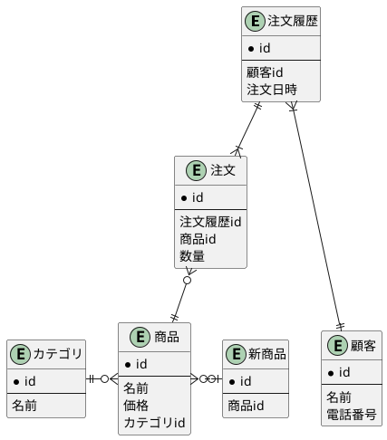

# お持ち帰りご注文用紙

```plantuml
@startuml
Entity 注文履歴 {
  *id
  --
  顧客id
  注文日時
}
Entity 注文 {
  *id
  --
  注文履歴id
  商品id
  数量
}
Entity 顧客 {
  *id
  --
  名前
  電話番号
}
Entity 商品 {
  *id
  --
  名前
  価格
  カテゴリid
}
Entity カテゴリ {
  *id
  --
  名前
}
Entity 新商品 {
  *id
  --
  商品id
}

注文履歴 ||--|{ 注文
注文履歴 }|---|| 顧客
注文  }o--|| 商品
カテゴリ ||-o{ 商品
新商品 |o-o{ 商品
@enduml
```
