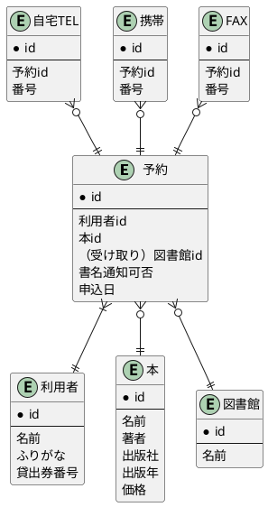

# 図書館の予約申込書

```plantuml
@startuml
Entity 予約 {
  *id
  --
  利用者id
  本id
  （受け取り）図書館id
  書名通知可否
  申込日
}

Entity 利用者 {
  *id
  --
  名前
  ふりがな
  貸出券番号
}

Entity 本 {
  *id
  --
  名前
  著者
  出版社
  出版年
  価格
}

Entity 自宅TEL {
  *id
  --
  予約id
  番号
}

Entity 携帯 {
  *id
  --
  予約id
  番号
}

Entity FAX {
  *id
  --
  予約id
  番号
}

Entity 図書館 {
  *id
  --
  名前
}

予約 }|--|| 利用者
予約 }o--|| 本
予約 }o--|| 図書館
自宅TEL }o--|| 予約
携帯 }o--|| 予約
FAX }o--|| 予約
@enduml
```
