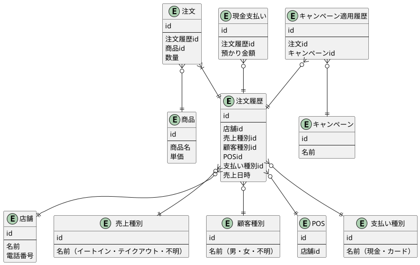

# ハンバーガーショップのレシート

```plantuml
@startuml
Entity 注文履歴 {
  id
  --
  店舗id
  売上種別id
  顧客種別id
  POSid
  支払い種別id
  売上日時
}

Entity 注文 {
  id
  --
  注文履歴id
  商品id
  数量
}

Entity 現金支払い {
  id
  --
  注文履歴id
  預かり金額
}

Entity 商品 {
  id
  --
  商品名
  単価
}

Entity 店舗 {
  id
  --
  名前
  電話番号
}

Entity キャンペーン {
  id
  --
  名前
}

Entity キャンペーン適用履歴 {
  id
  --
  注文id
  キャンペーンid
}

Entity 売上種別 {
  id
  --
  名前（イートイン・テイクアウト・不明）
}

Entity 顧客種別 {
  id
  --
  名前（男・女・不明）
}

Entity POS {
  id
  --
  店舗id
}

Entity 支払い種別 {
  id
  --
  名前（現金・カード）
}

注文履歴 }o--|| 店舗
注文履歴 }o--|| 売上種別
注文履歴 }o--|| 顧客種別
注文履歴 }o--|| POS
注文履歴 }o--|| 支払い種別
注文 }|--|| 注文履歴
注文 }o--|| 商品
現金支払い }o--|| 注文履歴
キャンペーン適用履歴 }o--|| 注文履歴
キャンペーン適用履歴 }o--|| キャンペーン
@enduml
```
